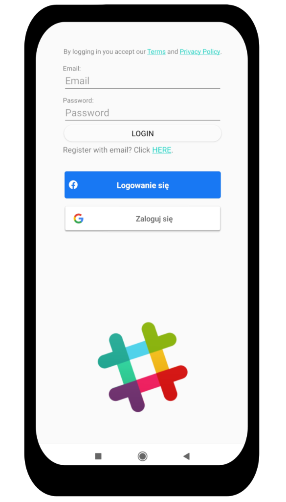
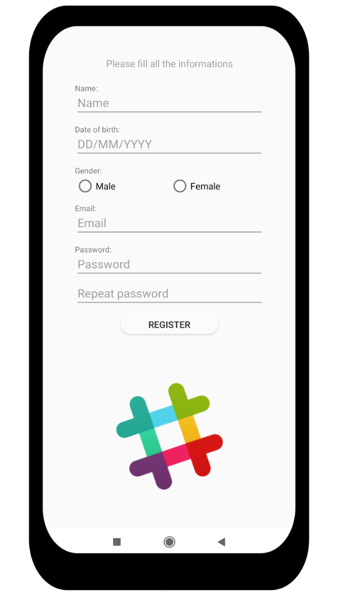
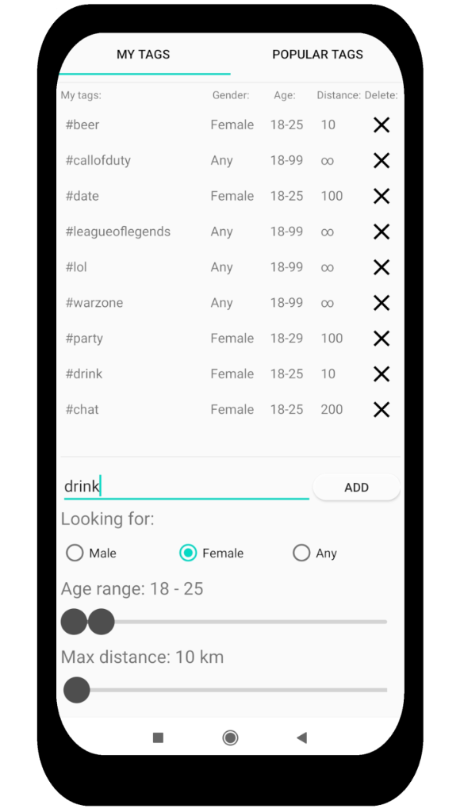
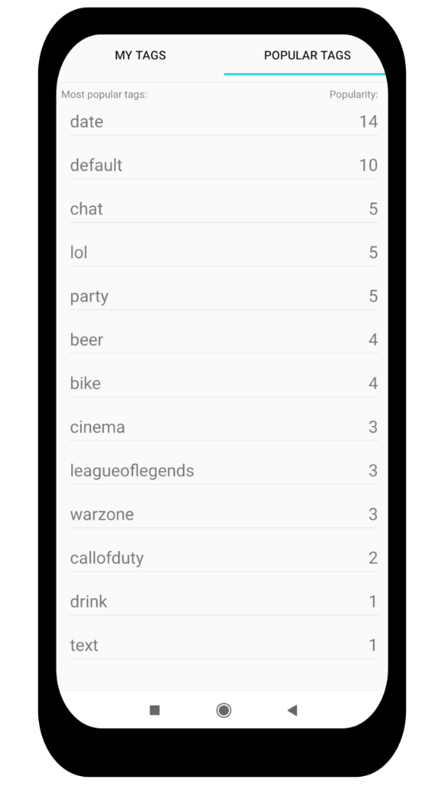
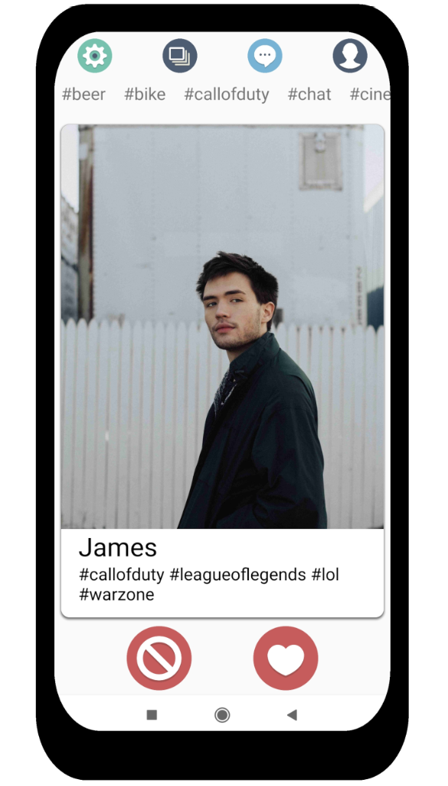
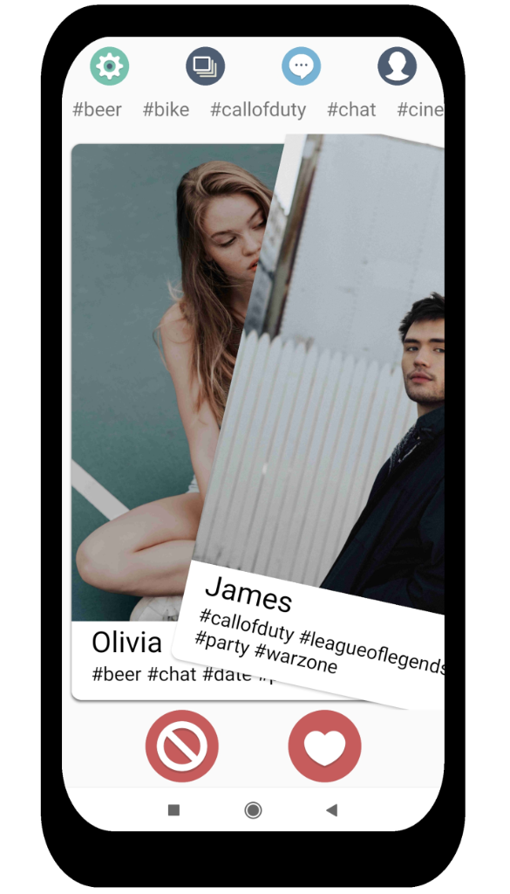
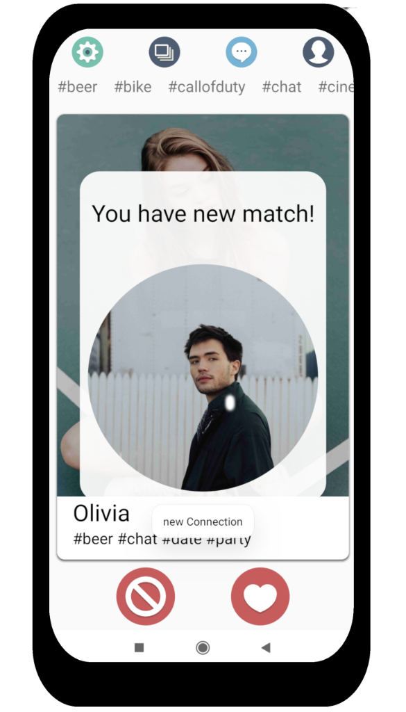
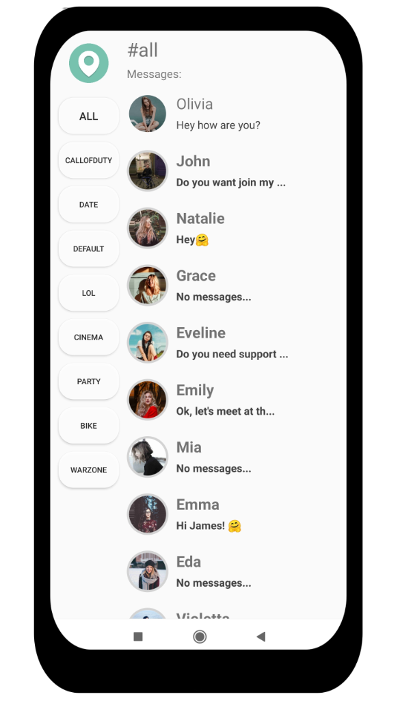
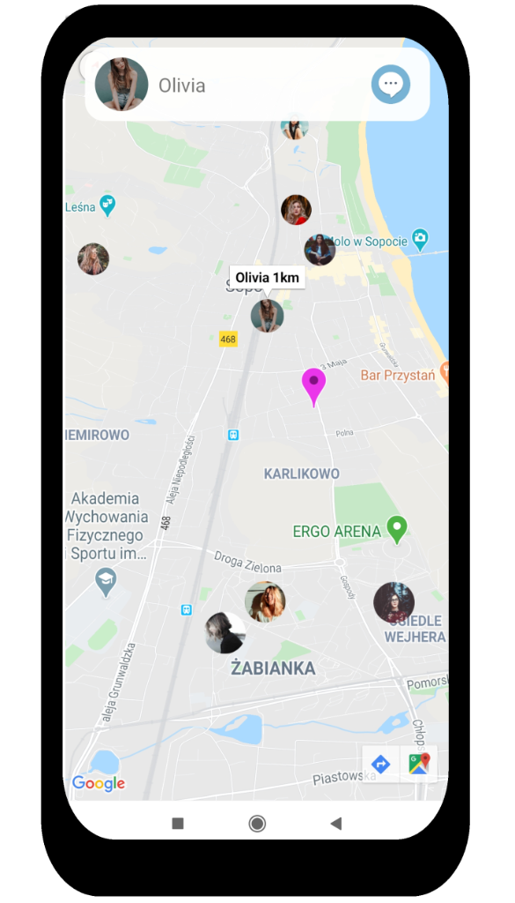
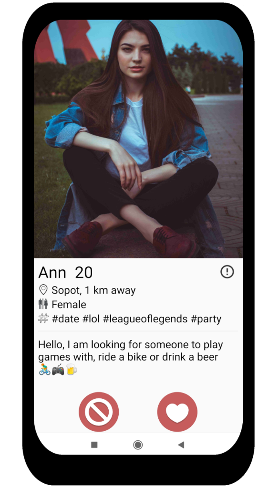

# Pinder App 


Screenshots: \












\

Any questions:
# seba23495@gmail.com

\
Repository made public to improve the recruitment process. \
It does not have a specific license, which means:


# [No License.](https://choosealicense.com/no-permission/)

```
If you find software that doesn’t have a license, that generally means you have no permission from 
the creators of the software to use,modify, or share the software. Although a code host such as GitHub
may allow you to view and fork the code, this does not imply that you are permitted to use, modify,
or share the software for any purpose.
```
